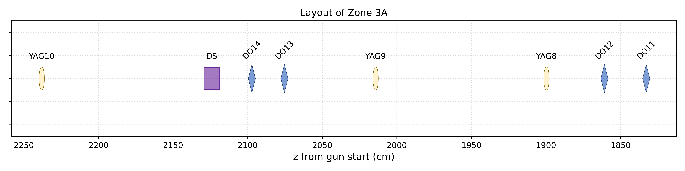
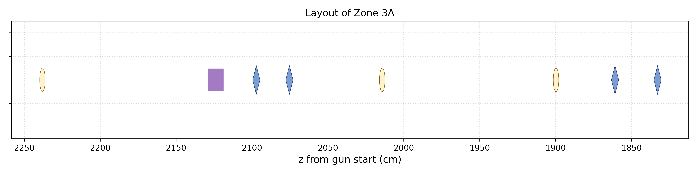
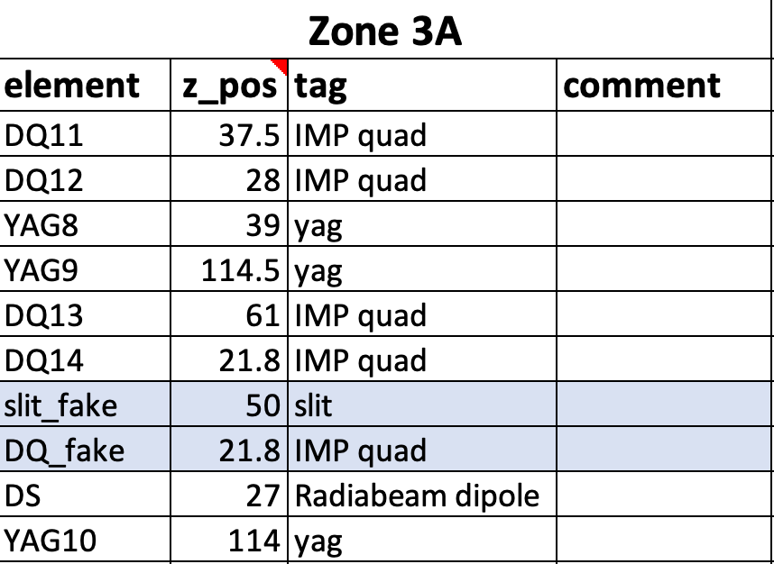
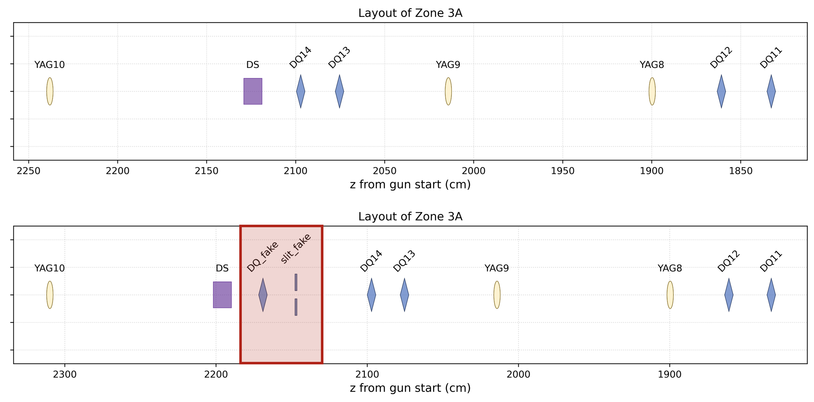
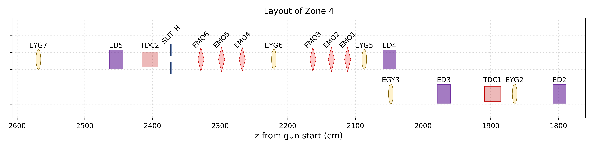
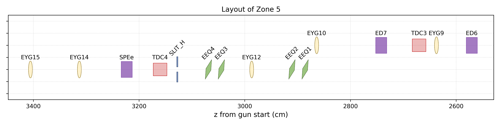

# AWA_beamline_layout

## Description
Generate beamline layout based on the csv input file.

## Usage
1. Install all packages in `requirements.txt`.

2. In `setup.py`, change/verify the path to the beamline input csv (`path_csv_file`), and the image folder for all beamline elements (`path_beamline_element`).

3. Run `main.py` to generate the specific zone map of the beamline, 
   ```python
   from function import *
   from setup import *
   
   data = InputFile(path_csv_file)
   data.sort_input()
   ```
   If want to have label plotted together , 
   ```python
   plot_beam_layout(data.zone_3A_element, data.zone_3A_zpos, data.zone_3A_tag, data.zone_3A_comment, zone='3A',
                    show_label=True, save_image=save_image)
   ```
   
   If want to hide the label, 
   ```python
   plot_beam_layout(data.zone_4_element, data.zone_4_zpos, data.zone_4_tag, data.zone_4_comment, zone='4',
                    show_label=False, save_image=save_image)
   ```
   

### To revise the beamline layout
1. In the beamline csv input file, all elements are put under the corresponding zones, ie.
   
   | Zone 1  |       |     |         |
   |:-------:|:-----:|:---:|:-------:|
   | element | z_pos | tag | comment |
   where,
   - element - name for the individual element
   - z_pos - z distance between the current element and the previous one
   - tag - the category tag for each element.
   - comment - this is meaningless, and for plotting purpose only. 

2. the current available tags are shown in the following table. The corresponding figures to each element can be changed by replacing the image file in `img`.
   
   | Available Tags                                                                                              |
   |:-----------------------------------------------------------------------------------------------------------:|
   | gun, solenoid, linac, yag, <br/>Radiabeam skew, Radiabeam dipole, <br/>IMP quad, peach quad, <br/>tdc, slit |

3. If extra elements are added to the beamline, simply insert the element under the zone. Note: the sequence of the elements DOES matter for plotting.


   

   
   
## TODOs
- [ ] Add an option to generate the whole beamline map.
- [ ] Add extra YAGs on the deflected path after all dipoles (mainly in zone 4 and 5).

   
   