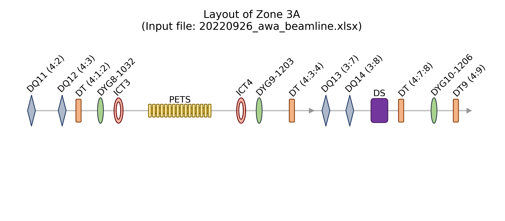
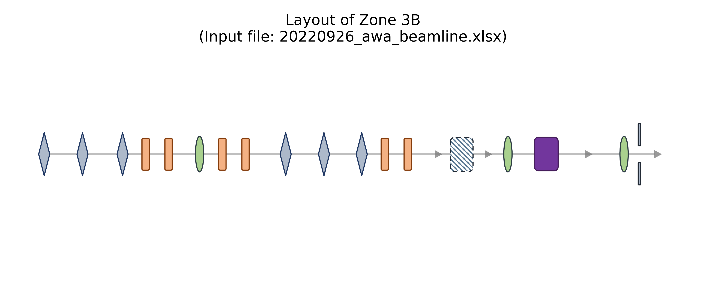
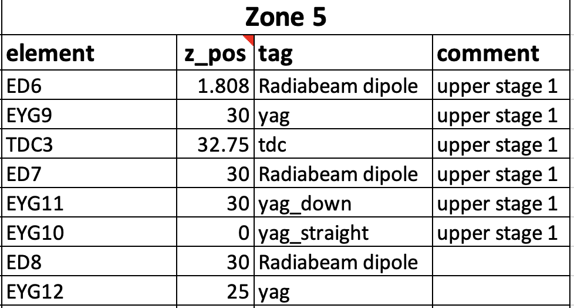
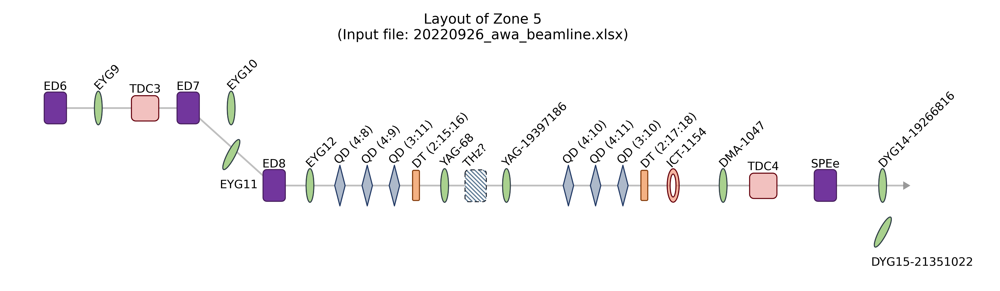
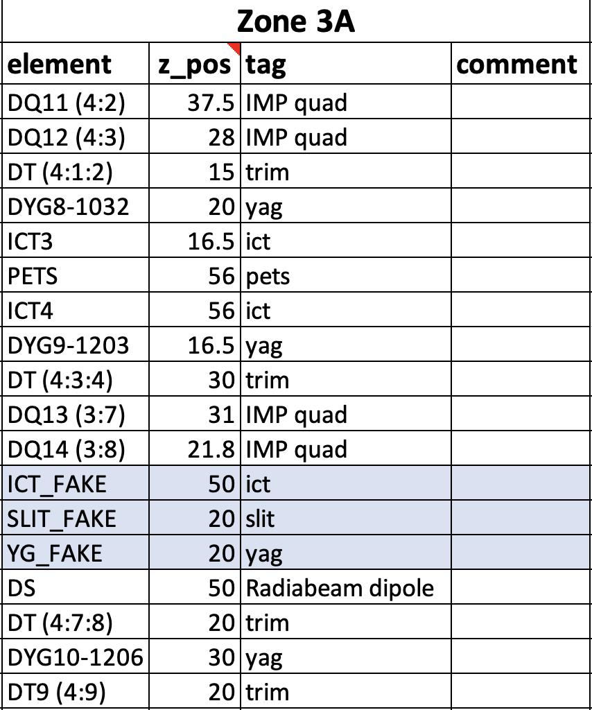
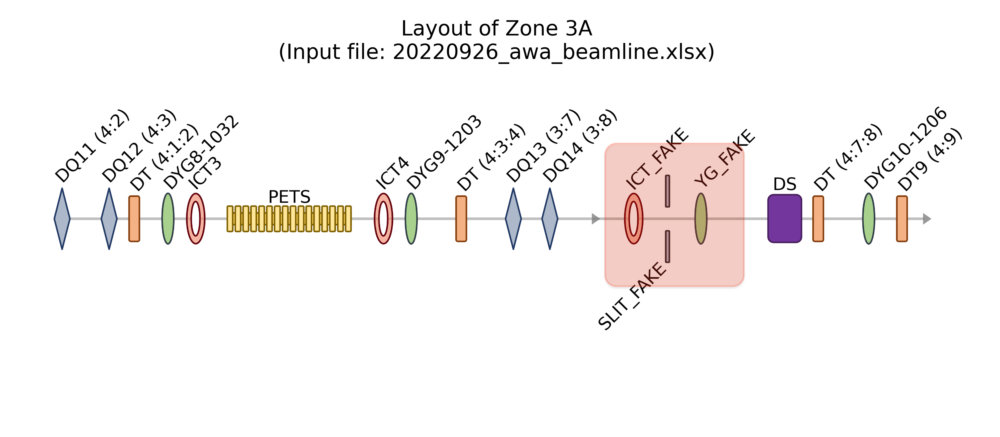

# AWA_beamline_layout

## Description
Generate beamline layout based on the csv input file.

## Usage
1. Install all packages in `requirements.txt`.

2. In `setup.py`, change/verify the path to the beamline input xlsx (`path_parent_xlsx_file`), and the image folder for 
all beamline elements (`path_beamline_element`). 

3. Run `main.py` to generate the specific zone map of the beamline, 
   ```python
   from function import *
   from setup import *
   
   data = InputFile(path_csv_file)
   data.sort_input()
   ```
   If you want to have the label plotted together , 
   ```python
   plot_beam_layout(data.zone_3A_element, data.zone_3A_zpos, 
                    data.zone_3A_tag, data.zone_3A_comment, 
                    zone='3A',
                    show_label=True, save_image=False)
   ```
   
   If you want to hide the label, 
   ```python
   plot_beam_layout(data.zone_4_element, data.zone_4_zpos, 
                    data.zone_4_tag, data.zone_4_comment, 
                    zone='4',
                    show_label=False, save_image=False)
   ```
   
4. To draw the deflected path (i.e. zone 5), add the comments of <strong>upper stage 1</strong> or <strong>upper stage 2</strong>.
   
   
   
   

### To revise the beamline layout
1. In the beamline csv input file, all elements are put under the corresponding zone with the given headers, i.e.
   
   | Zone 1  |       |     |         |
   |:-------:|:-----:|:---:|:-------:|
   | element | z_pos | tag | comment |
   
   where,
   - element - name for the individual element
   - z_pos - z distance between the current element and the previous one
   - tag - the category tag for each element.
   - comment - meaningless, for plotting the deflected paths only. 

   The current available tags are shown in the following table. The corresponding figures to each element can be changed by replacing the image file in `img`.

   | Available Tags                                                                                                                                                    |
   |:-----------------------------------------------------------------------------------------------------------:|
   | gun, solenoid, linac, yag, Radiabeam skew, Radiabeam dipole, <br/>IMP quad, peach quad, tdc, slit, ict, pets, dut, <br/>trim, yag_down, yag_up, yag_straight, dot |

2. If extra elements are added to the beamline, simply insert the element under the zone column. Note: the sequence of the elements DOES matter for plotting.

   
   
   
   
## TODOs
- [ ] Make the tag case-insensitive.
- [ ] Add an option to generate the whole beamline map.